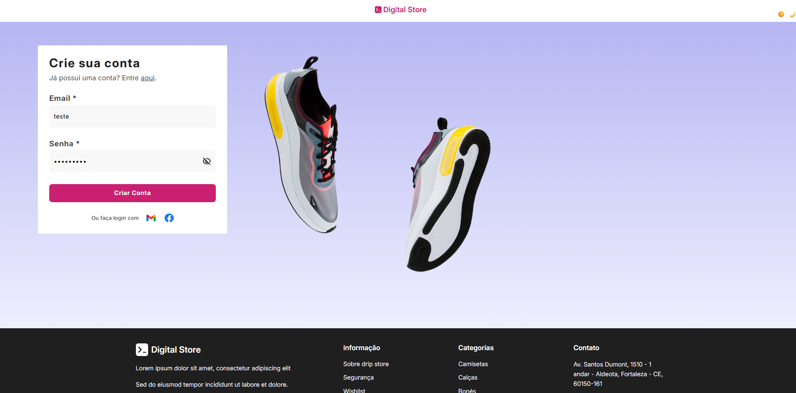
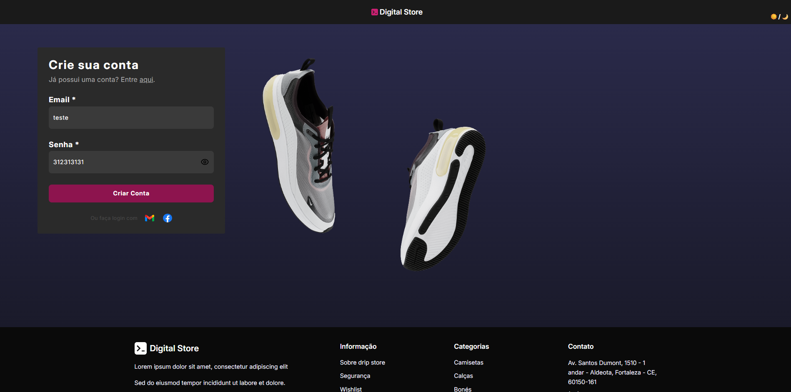
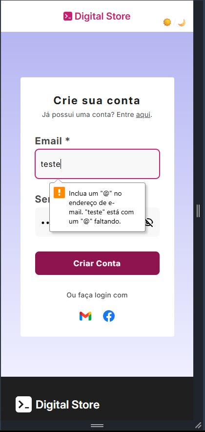
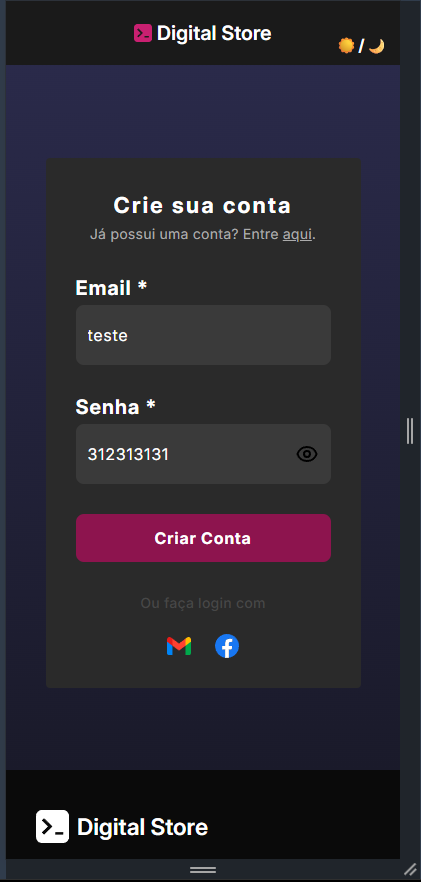

# Digital Store

Projeto desenvolvido durante o curso de Programador Full Stack da Digital College. Trata-se do desenvolvimento do front-end de uma plataforma de e-commerce voltada para a venda de calçados.

## 📸 Preview do Projeto

### 💻 Desktop

### 📱 Mobile

## Objetivo

O foco principal deste projeto é a aplicação prática de conceitos fundamentais de desenvolvimento web, garantindo que a interface seja fiel ao protótipo e ofereça uma boa experiência de navegação ao usuário.

## Tecnologias Utilizadas

* **HTML5:** Estruturação semântica do conteúdo para melhor acessibilidade e SEO.
* **CSS3:** Estilização avançada com foco em layout e design responsivo.
* **Figma:** Utilizado como base para a fidelidade visual e extração de ativos.

## Competências Aplicadas

* **Estruturação Semântica:** Uso correto de tags HTML para otimização de mecanismos de busca.
* **Responsividade:** Adaptação da interface para diferentes tamanhos de tela e dispositivos.
* **Versionamento:** Uso do Git para controle de alterações e histórico do projeto.
* **Manipulação de Ativos:** Organização e otimização de imagens e ícones em formato SVG e PNG.

